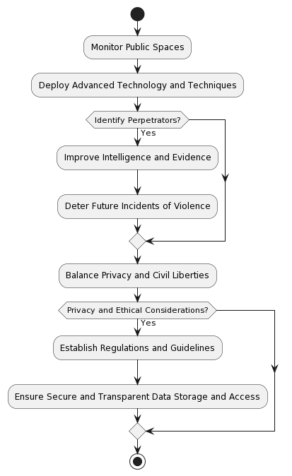
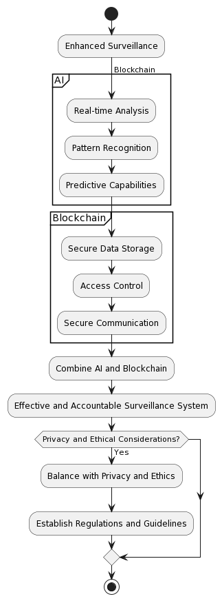

# Enhanced Surveillance

AI and blockchain can play significant roles in enhancing surveillance systems, making them more efficient, accurate, and secure. These technologies can be integrated into various aspects of the surveillance process to improve overall effectiveness. Here's how each technology can contribute to enhanced surveillance:

AI in Enhanced Surveillance:
a. Video analytics: AI algorithms can analyze CCTV footage in real-time, detecting unusual or suspicious behavior, such as loitering, aggressive movements, or the formation of large crowds. This allows law enforcement to respond quickly to potential incidents.

b. Facial recognition: AI-powered facial recognition technology can identify known criminals or persons of interest from CCTV footage by cross-referencing images with criminal databases. This helps in the rapid apprehension of suspects and can deter criminal activities.

c. Social media monitoring: AI can process vast amounts of data from social media platforms to identify potential threats, such as planned gatherings or indications of criminal intent. Sentiment analysis and natural language processing (NLP) techniques can help detect keywords, hashtags, and trends related to violence or other criminal activities.

d. Predictive analytics: AI can analyze historical data and identify patterns, trends, and correlations between different variables to predict potential future incidents. This enables law enforcement agencies to allocate resources more efficiently and take preventive measures.

e. Data integration and analysis: AI can integrate and analyze data from various sources, such as video feeds, social media, and gunshot detection systems, to create a comprehensive view of potential threats and incidents. This helps identify connections and patterns that might otherwise be overlooked.

Blockchain in Enhanced Surveillance:
a. Secure data storage: Blockchain can provide a secure, decentralized, and tamper-proof way to store surveillance data. Each block in the chain contains a set of records, which are linked together using cryptography. Once a block is added to the chain, it cannot be altered, ensuring the integrity of the stored data.

b. Access control and transparency: Blockchain can help ensure that surveillance data is accessed only by authorized individuals, as each access request must be verified through cryptographic techniques. This creates a transparent and auditable trail of data access, ensuring accountability and preventing unauthorized use of sensitive information.

c. Secure communication: Blockchain can be used to facilitate secure communication between different surveillance systems and stakeholders. Messages can be encrypted and verified using cryptographic techniques, ensuring that only authorized parties can access the information.

d. Identity management: Blockchain can provide a decentralized and secure framework for managing digital identities. This can help enhance facial recognition technology by allowing for secure and verifiable sharing of biometric data between law enforcement agencies and other stakeholders.

e. Supply chain traceability: In the context of surveillance equipment, blockchain can provide end-to-end traceability for devices and components, ensuring the integrity and authenticity of the equipment being used. This can help prevent the use of counterfeit or compromised devices.

In conclusion, AI and blockchain can significantly contribute to enhanced surveillance by improving the efficiency, accuracy, and security of various processes. AI can help with real-time analysis, pattern recognition, and predictive capabilities, while blockchain can ensure secure data storage, access control, and communication. Together, these technologies can help create a more effective and accountable surveillance system. However, it is essential to balance their use with privacy and ethical considerations.

## AIBC Enhanced Surveillance

AI and blockchain can play significant roles in enhancing surveillance systems, making them more efficient, accurate, and secure. These technologies can be integrated into various aspects of the surveillance process to improve overall effectiveness. Here's how each technology can contribute to enhanced surveillance:

AI in Enhanced Surveillance:
a. Video analytics: AI algorithms can analyze CCTV footage in real-time, detecting unusual or suspicious behavior, such as loitering, aggressive movements, or the formation of large crowds. This allows law enforcement to respond quickly to potential incidents.

b. Facial recognition: AI-powered facial recognition technology can identify known criminals or persons of interest from CCTV footage by cross-referencing images with criminal databases. This helps in the rapid apprehension of suspects and can deter criminal activities.

c. Social media monitoring: AI can process vast amounts of data from social media platforms to identify potential threats, such as planned gatherings or indications of criminal intent. Sentiment analysis and natural language processing (NLP) techniques can help detect keywords, hashtags, and trends related to violence or other criminal activities.

d. Predictive analytics: AI can analyze historical data and identify patterns, trends, and correlations between different variables to predict potential future incidents. This enables law enforcement agencies to allocate resources more efficiently and take preventive measures.

e. Data integration and analysis: AI can integrate and analyze data from various sources, such as video feeds, social media, and gunshot detection systems, to create a comprehensive view of potential threats and incidents. This helps identify connections and patterns that might otherwise be overlooked.

Blockchain in Enhanced Surveillance:
a. Secure data storage: Blockchain can provide a secure, decentralized, and tamper-proof way to store surveillance data. Each block in the chain contains a set of records, which are linked together using cryptography. Once a block is added to the chain, it cannot be altered, ensuring the integrity of the stored data.

b. Access control and transparency: Blockchain can help ensure that surveillance data is accessed only by authorized individuals, as each access request must be verified through cryptographic techniques. This creates a transparent and auditable trail of data access, ensuring accountability and preventing unauthorized use of sensitive information.

c. Secure communication: Blockchain can be used to facilitate secure communication between different surveillance systems and stakeholders. Messages can be encrypted and verified using cryptographic techniques, ensuring that only authorized parties can access the information.

d. Identity management: Blockchain can provide a decentralized and secure framework for managing digital identities. This can help enhance facial recognition technology by allowing for secure and verifiable sharing of biometric data between law enforcement agencies and other stakeholders.

e. Supply chain traceability: In the context of surveillance equipment, blockchain can provide end-to-end traceability for devices and components, ensuring the integrity and authenticity of the equipment being used. This can help prevent the use of counterfeit or compromised devices.

In conclusion, AI and blockchain can significantly contribute to enhanced surveillance by improving the efficiency, accuracy, and security of various processes. AI can help with real-time analysis, pattern recognition, and predictive capabilities, while blockchain can ensure secure data storage, access control, and communication. Together, these technologies can help create a more effective and accountable surveillance system. However, it is essential to balance their use with privacy and ethical considerations.

