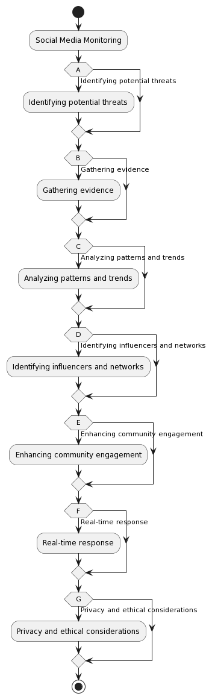
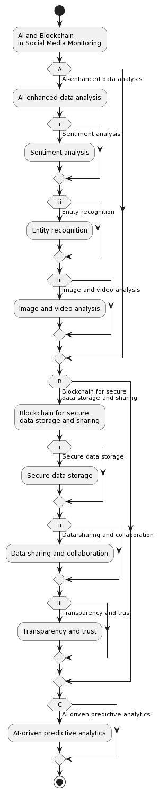

# Social Media Monitoring

Social media monitoring is a technique used to gather, analyze, and interpret data from social media platforms, in order to identify potential threats, criminal activities, and to aid law enforcement in the prevention and investigation of crime. In the context of the scenario mentioned, social media monitoring could be employed to find the perpetrators of the violence and deter future incidents. Below are some key aspects of social media monitoring in this context:

Identifying potential threats: Law enforcement agencies can use social media monitoring tools to track keywords, hashtags, and phrases related to planned or ongoing criminal activities, such as riots or shootings. This can help identify potential threats before they escalate and enable the authorities to take proactive measures.

Gathering evidence: Social media monitoring can be an effective way to gather evidence on the perpetrators involved in criminal activities. Users often post photos, videos, or comments about incidents they witnessed or participated in. This digital evidence can be crucial in identifying and apprehending the culprits.

Analyzing patterns and trends: By monitoring social media, law enforcement can analyze patterns and trends in criminal activities. This information can be used to predict future incidents and deploy resources strategically to prevent them.

Identifying influencers and networks: Social media monitoring can help identify key individuals who may be instigating or promoting violence, as well as the networks they are part of. By targeting these influencers and breaking up these networks, law enforcement can disrupt the chain of command and hinder the organization of future incidents.

Enhancing community engagement: Social media platforms can serve as an effective communication channel between law enforcement agencies and the community. By monitoring social media, the authorities can gather valuable insights into public sentiment and address concerns in a timely manner. This can help build trust and foster a sense of shared responsibility for public safety.

Real-time response: Social media monitoring allows law enforcement to receive real-time updates on developing situations. This enables them to respond quickly and efficiently to incidents, potentially minimizing damage and saving lives.

Privacy and ethical considerations: While social media monitoring can be an effective tool in preventing and investigating crime, it is essential to strike a balance between security and privacy. Law enforcement agencies must adhere to strict ethical guidelines and legal regulations to ensure that the privacy rights of individuals are not violated.

In summary, social media monitoring can play a vital role in identifying perpetrators of violence, gathering evidence, and deterring future incidents. However, it is crucial that law enforcement agencies use this tool responsibly, taking into consideration the privacy and ethical concerns associated with monitoring social media platforms.

## AIBC Social Media Monitoring

AI and blockchain technologies can work together to enhance social media monitoring capabilities, making it more effective and secure. Here's a detailed explanation of how these technologies can be applied to social media monitoring:

AI-enhanced data analysis:
Artificial intelligence, particularly machine learning and natural language processing (NLP), can be used to analyze large volumes of data from social media platforms. AI algorithms can sift through vast amounts of text, images, and videos, identifying patterns, trends, and anomalies that may indicate criminal activity or the planning of violent incidents. Some specific applications of AI in social media monitoring include:

a. Sentiment analysis: AI-powered sentiment analysis tools can evaluate the emotions and attitudes expressed in social media posts. This helps identify potentially dangerous content, such as posts expressing extreme anger or promoting violence.

b. Entity recognition: NLP techniques can be used to identify key entities (people, places, organizations) in social media posts, which can help pinpoint potential criminal networks or influencers instigating violence.

c. Image and video analysis: Machine learning algorithms, such as deep learning and computer vision, can analyze images and videos to identify specific objects, scenes, or activities related to criminal incidents. This can aid in gathering evidence and identifying potential suspects.

Blockchain for secure data storage and sharing:
Blockchain technology can be employed to securely store and share data gathered from social media monitoring. This decentralized, tamper-proof system ensures data integrity and privacy. Some ways blockchain can be utilized in social media monitoring are:

a. Secure data storage: Blockchain can store digital evidence, such as images, videos, and text, in a decentralized and tamper-proof manner. This can help maintain the integrity of the evidence and prevent unauthorized access or manipulation.

b. Data sharing and collaboration: Blockchain technology can facilitate secure data sharing between different law enforcement agencies or organizations involved in social media monitoring. This can help streamline communication and collaboration while ensuring data privacy.

c. Transparency and trust: Blockchain's transparent and immutable nature can help establish trust among stakeholders, such as law enforcement, social media platforms, and the public. It ensures that the data used for monitoring is authentic and has not been tampered with.

AI-driven predictive analytics:
By combining AI and blockchain, predictive analytics can be used to forecast potential threats and criminal activities. AI algorithms can analyze historical data, patterns, and trends to predict future incidents. These predictions can be stored securely on a blockchain, ensuring that the data is accurate and reliable. Law enforcement agencies can then use these insights to allocate resources strategically, preventing and mitigating potential threats.

In summary, AI and blockchain technologies can significantly enhance social media monitoring by improving data analysis, ensuring secure storage and sharing of data, and enabling predictive analytics. By leveraging these technologies, law enforcement agencies can effectively identify potential threats, gather evidence, and deter future incidents of violence. However, it is essential to consider the privacy and ethical implications of using these technologies and strike a balance between security and individual rights.

