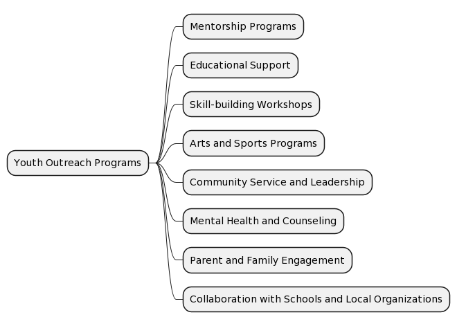
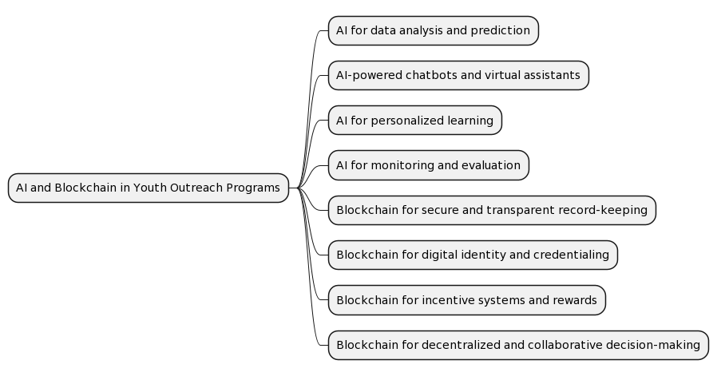

# Youth Outreach Programs

Youth Outreach Programs are initiatives designed to engage young people and provide them with support, resources, and opportunities to help them develop positively, reduce their involvement in risky or criminal behavior, and ultimately deter future incidents of violence. These programs can take many different forms, but generally share the common goal of fostering a sense of belonging and purpose among youth. Below are some key aspects and examples of Youth Outreach Programs:

Mentorship programs: Pairing at-risk youths with positive role models from their community can provide guidance, support, and inspiration. These mentors can share their personal experiences and insights, helping young people develop valuable life skills, make better choices, and envision a brighter future.

Educational support: Many outreach programs offer tutoring, homework assistance, and other educational resources to help young people succeed academically. By promoting educational achievement, these programs can increase the likelihood of participants pursuing higher education or vocational training, which in turn can reduce their involvement in criminal activities.

Skill-building workshops: These workshops can cover a wide range of topics, from conflict resolution and communication skills to financial literacy and job readiness. By equipping young people with practical skills, these programs can help them navigate life's challenges more effectively and make more informed decisions.

Arts and sports programs: Engaging young people in extracurricular activities can provide them with constructive outlets for self-expression, creativity, and physical activity. These programs can help foster a sense of accomplishment and pride, as well as provide opportunities for socialization and teamwork.

Community service and leadership opportunities: Involving youth in community projects and giving them leadership roles can help them develop a sense of responsibility and commitment to their community. This can contribute to positive self-esteem and reduce the likelihood of engaging in destructive behavior.

Mental health and counseling services: Many outreach programs offer access to counseling and mental health services to address any underlying issues that may contribute to risky or criminal behavior. By providing a safe space for young people to discuss their feelings, challenges, and goals, these programs can support their emotional well-being and personal growth.

Parent and family engagement: Some outreach programs involve parents and families, recognizing that a supportive and nurturing home environment can be crucial to a young person's development. These programs may offer parenting classes, family counseling, or other resources to help create a stable and positive home life.

Collaboration with schools and local organizations: Successful youth outreach programs often work in partnership with schools, community centers, and other local organizations to create a network of support for young people. This collaboration can help ensure that resources are used efficiently and that participants receive the help they need across various aspects of their lives.

Overall, Youth Outreach Programs aim to provide young people with the tools, resources, and support they need to make positive choices and avoid engaging in violent or criminal behavior. By addressing the root causes of these issues, such programs can play a critical role in deterring future incidents of violence and promoting healthier, more resilient communities.

## AIBC Youth Outreach Programs

Artificial Intelligence (AI) and blockchain technology can significantly aid Youth Outreach Programs in various ways. By leveraging these advanced technologies, outreach initiatives can become more effective, targeted, and sustainable. Here's a detailed explanation of how AI and blockchain can contribute to the success of Youth Outreach Programs:

AI for data analysis and prediction:
AI algorithms can analyze vast amounts of data, identify patterns, and make predictions. By utilizing AI in Youth Outreach Programs, organizers can better understand the factors that contribute to at-risk youth behavior and the effectiveness of interventions. This can help in targeting resources more effectively and identifying individuals who may benefit most from the programs. Additionally, AI can predict potential hotspots for youth violence or crime, allowing for proactive intervention and resource allocation.

AI-powered chatbots and virtual assistants:
AI-powered chatbots and virtual assistants can be employed to provide personalized guidance, support, and resources to young people. These virtual tools can offer instant access to information, answer questions, and help users navigate through program offerings. They can also be used for mental health support, providing an initial point of contact for young people who may be reluctant to seek help from a human counselor.

AI for personalized learning:
AI can be used to develop personalized learning plans for young people based on their unique needs, strengths, and interests. By analyzing data from assessments, academic performance, and other factors, AI algorithms can tailor educational content and resources to maximize engagement and learning outcomes. This can help young people stay on track academically and increase their chances of success in the future.

AI for monitoring and evaluation:
AI can help program organizers monitor and evaluate the effectiveness of Youth Outreach Programs by tracking participation, engagement, and outcomes. AI-powered analytics tools can help identify the most successful strategies and interventions, enabling continuous improvement and data-driven decision-making.

Blockchain for secure and transparent record-keeping:
Blockchain technology can be employed to create secure, transparent, and tamper-proof records of program participation, achievements, and outcomes. This can help maintain the privacy of participants while providing a reliable source of data for monitoring, evaluation, and funding decisions.

Blockchain for digital identity and credentialing:
Blockchain can be used to create digital identities and credentials for young people participating in Youth Outreach Programs. This can enable them to access resources, services, and opportunities without the need for traditional identification documents, which can be particularly useful for marginalized or at-risk populations.

Blockchain for incentive systems and rewards:
Blockchain-based tokens or digital currencies can be used to incentivize participation and reward achievements in Youth Outreach Programs. By creating a transparent and secure system for tracking and rewarding positive behaviors, blockchain can help motivate young people to engage with the program and develop valuable life skills.

Blockchain for decentralized and collaborative decision-making:
Blockchain can be used to facilitate decentralized and collaborative decision-making among program organizers, participants, and stakeholders. This can help ensure that resources are allocated fairly and that the voices of young people and their communities are heard in the decision-making process.

Overall, AI and blockchain technologies can significantly enhance the effectiveness, accessibility, and sustainability of Youth Outreach Programs. By harnessing the power of these cutting-edge tools, program organizers can better target their interventions, engage young people, and ultimately promote positive development and deter future incidents of violence.

