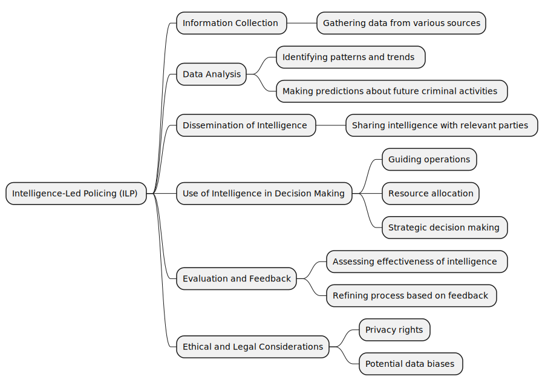
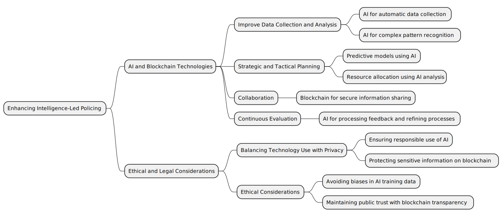

# Intelligence Led Policing

Absolutely. Intelligence-led policing (ILP) is a policing model that emphasizes information sharing, collaboration, and proactive (as opposed to reactive) analysis of information to guide decision-making. The goal of ILP is to increase the effectiveness and efficiency of the police by using intelligence to inform all aspects of the decision-making process. Here's a detailed explanation of its key components:

Information Collection: ILP heavily relies on the systematic collection of data. This data may come from a variety of sources including police reports, surveillance, social media, tips from the public, and even sophisticated technologies like facial recognition or gunshot detection systems. The collected data is then processed and stored in a way that it can be efficiently retrieved and used for analysis.

Data Analysis: Once data is collected, it is analyzed to identify patterns, trends, and associations. This might include mapping crime hotspots, identifying repeat offenders, or recognizing patterns of behavior that might indicate a larger criminal network or impending criminal activity. Data analysis is not only about past crimes but also about predicting where and when future crimes might occur.

Dissemination of Intelligence: The intelligence derived from data analysis is disseminated to the relevant parties. This might include patrol officers, detectives, senior police leadership, or even other agencies or partners. The intelligence should be timely, accurate, and relevant to the recipient. It can be used to guide operations, resource allocation, and strategic decision-making.

Use of Intelligence in Decision Making: Intelligence is used to guide all aspects of policing - from tactical decisions like how and where to deploy officers, to strategic decisions like resource allocation and policy development. The goal is to make policing more proactive, targeted, and effective.

Evaluation and Feedback: The last step in the ILP process is to evaluate the effectiveness of the intelligence and the actions taken based on it. This feedback loop helps refine the process, correcting any inaccuracies or inefficiencies, and ensuring that the intelligence is as useful and actionable as possible.

In the context of your scenario, an ILP approach might look something like this:

Information Collection: Gathering data about the riot and shootings from police reports, witness statements, CCTV footage, social media posts, etc.

Data Analysis: Analyzing the data to identify the perpetrators, understand the causes and circumstances of the violence, and predict where and when similar incidents might occur in the future.

Dissemination of Intelligence: Sharing this intelligence with the officers investigating the incident, patrols in areas where similar incidents might occur, and police leadership.

Use of Intelligence in Decision Making: Using the intelligence to guide the investigation, patrol deployments, and strategies for preventing similar incidents in the future.

Evaluation and Feedback: After actions have been taken, evaluating the results and using this feedback to refine the ILP process.

It's important to note that while ILP can significantly improve the effectiveness and efficiency of policing, it also raises important ethical and legal questions, particularly around privacy rights and potential biases in data collection and analysis. These considerations must be carefully managed to ensure that ILP is used responsibly and justly.

Intelligence-Led Policing (ILP) is a proactive law enforcement model that emphasizes information gathering, analysis, and sharing to guide decision-making processes. It consists of five main stages:

Information Collection: Gathering data from various sources like police reports, public tips, surveillance, social media, and advanced technologies.

Data Analysis: Analyzing data to identify patterns, trends, and make predictions about future criminal activities.

Dissemination of Intelligence: Sharing the analyzed intelligence with relevant parties such as patrol officers, detectives, senior police leadership, and other agencies.

Use of Intelligence in Decision Making: Utilizing the intelligence to guide operations, allocate resources, and make strategic decisions.

Evaluation and Feedback: Assessing the effectiveness of the intelligence and actions taken based on it, refining the process as necessary.

In the context of preventing and solving crimes like riots or shootings, ILP helps in systematically collecting and analyzing data, identifying potential threats, and deploying resources efficiently. However, it must be implemented responsibly, taking into account ethical and legal considerations, particularly around privacy rights and potential data biases.

## AIBC - Intelligence-Led Policing

Artificial Intelligence (AI) and Blockchain are two technologies that can significantly enhance Intelligence-Led Policing (ILP) in various ways. Let's discuss each technology in detail:

1. Artificial Intelligence (AI):

AI can assist in ILP in multiple aspects, such as data collection, analysis, and predictive modeling.

Data Collection and Processing: AI technologies, such as Natural Language Processing (NLP), can automate and enhance the process of collecting and processing data from various sources like social media, news reports, and public tips. It can sift through large volumes of data quickly, identify relevant information, and categorize it for further analysis.

Data Analysis: Machine learning, a subset of AI, can analyze complex patterns and trends in the collected data that might be too subtle or complex for humans to detect. For instance, it can help identify crime hotspots, patterns of criminal behavior, and links between different crimes or criminals.

Predictive Policing: AI can be used to create predictive models that forecast where and when crimes are likely to occur based on historical data. This allows police to proactively deploy resources and prevent crimes before they happen.

Facial Recognition: AI-powered facial recognition can help identify suspects from surveillance footage or social media, speeding up investigations and potentially catching criminals who might otherwise remain undetected.

Blockchain:

Blockchain technology, known for its role in cryptocurrencies, can also be applied in ILP. Its core features - decentralization, immutability, and transparency - make it useful for evidence management, information sharing, and maintaining public trust.

Evidence Management: Blockchain can provide a secure, tamper-proof system for storing and managing digital evidence. Once evidence is recorded on a blockchain, it can't be altered or deleted, which helps ensure the integrity of the evidence and the fairness of investigations.

Information Sharing: Blockchain can facilitate secure, decentralized information sharing between different law enforcement agencies. This can help break down silos, improve collaboration, and ensure that all relevant parties have access to the information they need.

Maintaining Public Trust: Blockchain's transparency can help maintain public trust in law enforcement. By recording actions and decisions on a public (or semi-public) blockchain, police can demonstrate that they are acting fairly and transparently.

It's important to note that while AI and blockchain can greatly enhance ILP, they also come with their own challenges and considerations. AI systems can be biased if they're trained on biased data, and they can infringe on privacy if not used responsibly. Similarly, while blockchain can enhance transparency, it can also pose privacy concerns if sensitive information is not adequately protected. It's therefore crucial to implement these technologies in a way that balances their benefits against these potential risks.

In conclusion , Artificial Intelligence (AI) and Blockchain technologies hold immense potential for enhancing Intelligence-Led Policing (ILP). AI can streamline data collection and processing, offer robust data analysis, aid in predictive policing, and support identification processes through facial recognition. On the other hand, Blockchain can ensure secure and tamper-proof evidence management, facilitate decentralized information sharing among law enforcement agencies, and maintain public trust through its inherent transparency.

However, while these technologies offer significant benefits, it's crucial to consider the ethical and legal implications associated with them. Biases in AI training data, potential privacy infringement, and ensuring adequate protection of sensitive information on blockchain are issues that need addressing. As we leverage these technologies for ILP, a balanced approach is necessary, one that maximizes their benefits while mitigating potential risks to uphold the principles of justice, fairness, and privacy.

