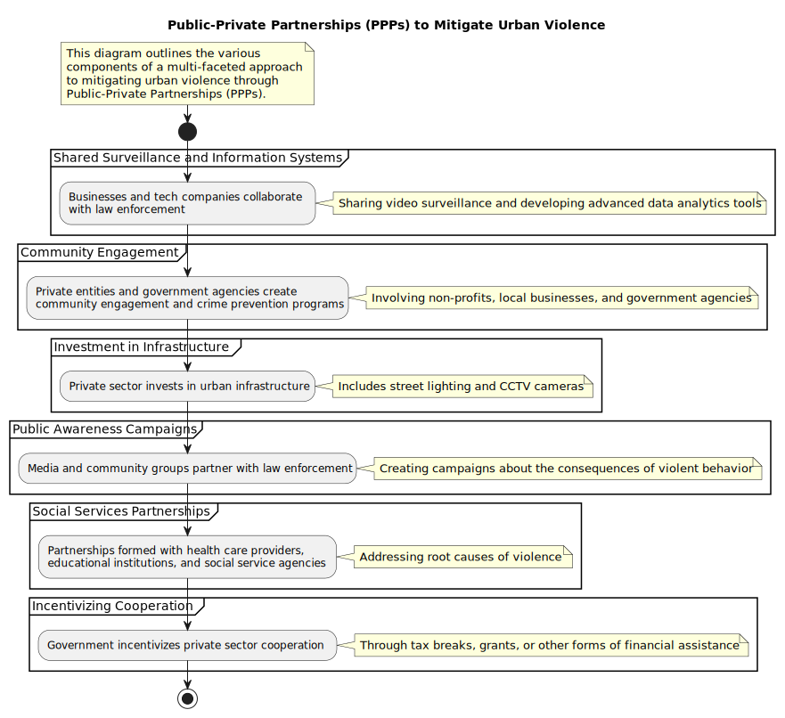
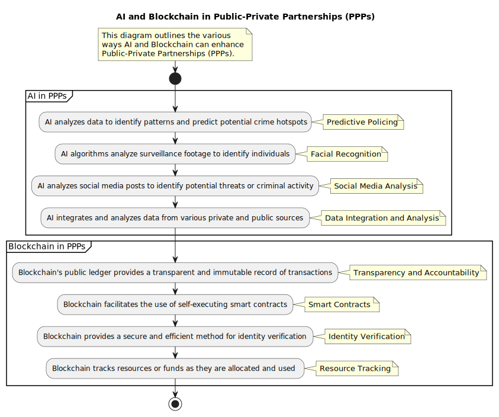

# Public Private Partnerships

Public-Private Partnerships (PPPs) are a critical component in addressing urban violence, as they bring together resources, expertise, and influence from both public (government) and private (businesses, non-profits, community organizations) sectors. In the context of the scenario provided, PPPs could be leveraged in several ways:

Shared Surveillance and Information Systems: Businesses could cooperate with law enforcement by sharing video surveillance and other relevant information. This could help identify perpetrators more quickly and efficiently. Moreover, technology companies could partner with the police to develop advanced analytics tools that could process and analyze vast amounts of data to spot patterns and predict potential incidents.

Community Engagement: Private entities, particularly non-profit organizations and local businesses, could work with government agencies to create programs aimed at community engagement and crime prevention. These could involve mentorship programs, recreational activities, job training, and other initiatives that provide constructive alternatives for youths at risk of engaging in violent behavior.

Investment in Infrastructure: Private companies could invest in urban infrastructure, such as street lighting and CCTV cameras, to deter crime. Improved lighting can reduce opportunities for criminal activities, and cameras can discourage potential perpetrators due to the increased risk of identification and prosecution.

Public Awareness Campaigns: Media organizations, along with community groups, could partner with law enforcement to create public awareness campaigns. These campaigns could educate the public about the consequences of violent behavior, inform them about the measures being taken to ensure public safety, and encourage them to report any suspicious activity.

Social Services Partnerships: Partnerships with health care providers, educational institutions, and social service agencies could help address the underlying causes of violence. These could involve efforts to improve mental health services, provide better educational opportunities, and offer social support for families in high-risk areas.

Incentivizing Cooperation: Government could provide incentives for private sector cooperation. These incentives could come in the form of tax breaks, grants, or other forms of financial assistance for businesses that contribute to violence prevention efforts.

Each of these strategies, when used in combination, could potentially help identify perpetrators of violence and deter future incidents. However, it's important to note that while PPPs can be highly effective, they also require careful management to ensure that all parties are fulfilling their responsibilities and that the partnership is producing the desired results.

Public-Private Partnerships (PPPs) play a crucial role in mitigating urban violence by combining resources and expertise from both sectors. Here's a summarized approach:

Shared Surveillance and Information Systems: Businesses and tech companies can collaborate with law enforcement, sharing video surveillance and developing advanced data analytics tools.

Community Engagement: Private entities like non-profits and local businesses can collaborate with government agencies to create community engagement and crime prevention programs.

Investment in Infrastructure: Private sector investment in urban infrastructure, like street lighting and CCTV cameras, can deter crime.

Public Awareness Campaigns: Media and community groups can partner with law enforcement to create public awareness campaigns about the consequences of violent behavior.

Social Services Partnerships: Partnerships with health care providers, educational institutions, and social service agencies can help address the root causes of violence.

Incentivizing Cooperation: Governments can incentivize private sector cooperation through tax breaks, grants, or other forms of financial assistance.

These strategies, used together, can help identify perpetrators and deter future violent incidents. Effective management is required to ensure all parties fulfill their responsibilities and achieve the desired results.

## AIBC Public-Private Partnerships

AI (Artificial Intelligence) and Blockchain can significantly aid Public-Private Partnerships (PPPs) in a variety of ways, enhancing efficiency, transparency, and collaboration.

AI in Public-Private Partnerships:

AI can be used to analyze vast amounts of data, identify patterns, and make predictions, which can be invaluable in crime prevention efforts.

Predictive Policing: AI can analyze data from various sources (like surveillance systems, social media, past crime records) to identify patterns and predict potential crime hotspots. This can allow law enforcement to focus their resources more effectively and possibly prevent crimes before they occur.

Facial Recognition: AI algorithms can be used to analyze surveillance footage and identify individuals. This can be helpful in identifying suspects or missing persons.

Social Media Analysis: AI can analyze social media posts to identify potential threats or criminal activity. This can provide valuable leads and early warning signs of potential violence.

Data Integration and Analysis: AI can help integrate and analyze data from various private and public sources, providing a more complete picture of the situation and helping to identify potential solutions.

Blockchain in Public-Private Partnerships:

Blockchain technology, known for its transparency and immutability, can be used to enhance trust, transparency, and efficiency in PPPs.

Transparency and Accountability: Blockchain's public ledger can provide a transparent and immutable record of transactions and interactions. This can be used to ensure accountability in the allocation and use of resources in PPPs.

Smart Contracts: Blockchain can facilitate the use of smart contracts, which are self-executing contracts with the terms of the agreement directly written into code. This can reduce bureaucracy, improve efficiency, and ensure all parties meet their obligations.

Identity Verification: Blockchain can provide a secure and efficient method for identity verification. This can be useful in various scenarios, from verifying the identity of individuals involved in a crime to ensuring the right people have access to sensitive data.

Resource Tracking: Blockchain can be used to track resources or funds as they are allocated and used, ensuring they are being used as intended and preventing fraud or misuse.

By integrating AI and Blockchain technologies into Public-Private Partnerships, it's possible to create a more effective, transparent, and efficient system for preventing and responding to urban violence. However, it's important to consider potential challenges and risks, such as privacy concerns, the digital divide, and the need for robust regulation and oversight.

