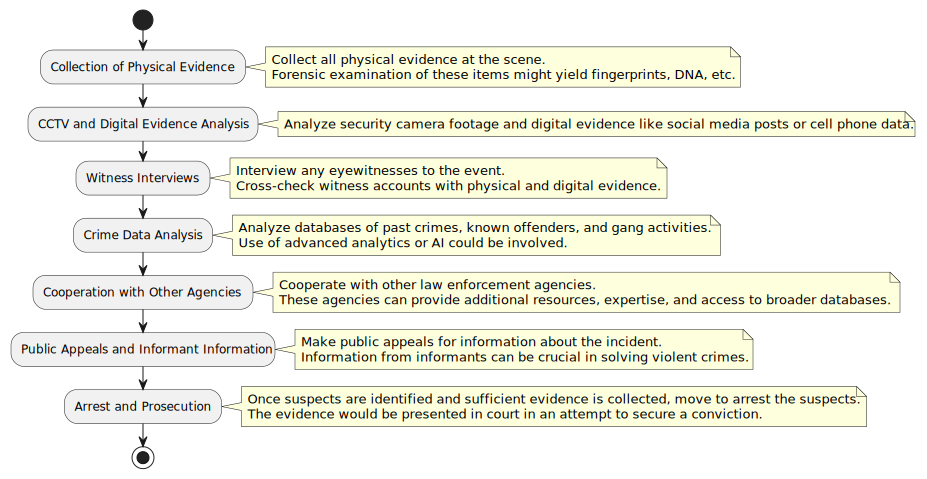
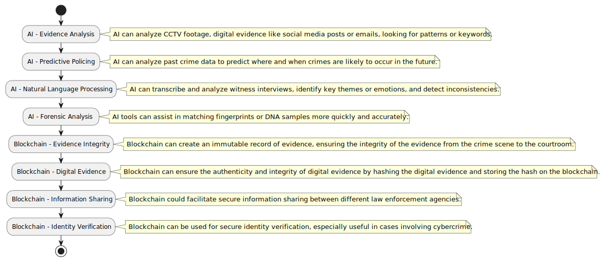

# Post Incident Investigation

Collection of Physical Evidence: After the incident, it's crucial to cordon off the scene and collect all physical evidence. This includes shell casings, weapons, clothing, or other items that could provide clues about the perpetrators. Forensic examination of these items might yield fingerprints, DNA, or other identifiable information.

CCTV and Digital Evidence Analysis: In many urban areas, security cameras (both public and private) may have captured the incident. Investigators would collect and analyze this footage for evidence. This could involve facial recognition technology or simply manual review to identify suspects. Similarly, digital evidence like social media posts or cell phone data can sometimes provide important clues.

Witness Interviews: Investigators would interview any eyewitnesses to the event. This can be a complex process, as it involves not just collecting information but also assessing the reliability of that information. Witness accounts need to be cross-checked with physical and digital evidence to create a comprehensive understanding of what happened.

Crime Data Analysis: Law enforcement agencies typically maintain databases of past crimes, known offenders, and gang activities. Analyzing this data can sometimes help identify patterns or suspects. This might involve the use of advanced analytics or AI.

Cooperation with Other Agencies: Often, the investigation of a violent incident will involve cooperation with other law enforcement agencies. This could include local police in other jurisdictions, state law enforcement, or federal agencies like the FBI. These agencies can provide additional resources, expertise, and access to broader databases of information.

Public Appeals and Informant Information: In some cases, the police might make public appeals for information about the incident. This could involve traditional media, social media, or other forms of communication. Additionally, information from informants (people within criminal networks who provide information to law enforcement) can be crucial in solving violent crimes.

Arrest and Prosecution: Once suspects have been identified and sufficient evidence has been collected, the police would move to arrest the suspects. This would then lead to the prosecution phase, where the evidence would be presented in court in an attempt to secure a conviction.

Summary: Post-Incident Investigation is a comprehensive approach to identifying the perpetrators of a violent incident. It involves collecting and analyzing physical and digital evidence, interviewing witnesses, analyzing crime data, cooperating with other law enforcement agencies, making public appeals for information, and using information from informants. The ultimate goal is to arrest and prosecute the perpetrators, which not only brings justice for the specific incident but also acts as a deterrent for future crimes.

## AIBC System for Post-Incident Investigation

AI (Artificial Intelligence) in Post-Incident Investigation

Evidence Analysis: AI can process vast amounts of data much more quickly and accurately than humans can. For instance, AI technologies such as Machine Learning can be used to analyze CCTV footage to identify suspects, vehicles, or unusual activities. Facial recognition technology can identify individuals in video or image data. Similarly, AI can analyze digital evidence like social media posts or emails, looking for keywords or patterns that might be relevant to the investigation.

Predictive Policing: AI can also be used for predictive policing, which involves using historical data to predict where crimes are likely to occur in the future. By analyzing past crime data, AI can identify patterns and trends that can help law enforcement prevent future crimes or respond more effectively when they do occur.

Natural Language Processing (NLP): AI can be used to transcribe and analyze witness interviews or interrogations. NLP can convert speech into text, identify key themes or emotions, and even detect deception or inconsistencies in statements.

Forensic Analysis: AI tools can assist in the forensic analysis of physical evidence. For instance, AI can match fingerprints or DNA samples more quickly and accurately than traditional methods.

Blockchain in Post-Incident Investigation

Evidence Integrity: Blockchain can be used to create an immutable record of evidence. When evidence is collected, its details can be recorded in a blockchain, creating a timestamped record that cannot be altered or tampered with. This can help ensure the integrity of the evidence from the crime scene to the courtroom.

Digital Evidence: In cases where digital evidence is collected (e.g., video footage, social media posts), blockchain can ensure the authenticity and integrity of this evidence. The digital evidence can be hashed and the hash can be stored on the blockchain. This provides a way to verify later that the digital evidence has not been altered.

Information Sharing: Blockchain could also facilitate secure information sharing between different law enforcement agencies. Each agency could have access to a shared blockchain, allowing them to add information and view information added by others. This could help streamline the investigation process and ensure all agencies are working with the same information.

Identity Verification: Blockchain can be used for secure identity verification. For example, if a suspect's identity needs to be confirmed, law enforcement could use a blockchain-based ID system. This would be especially useful in cases involving cybercrime, where traditional forms of ID may not be applicable.

In summary, AI can streamline the investigation process by automating tasks like evidence analysis, predictive policing, transcribing and analyzing interviews, and forensic analysis. Blockchain can improve the integrity and security of evidence and facilitate secure information sharing between agencies. Together, these technologies can make the post-incident investigation process more efficient and effective.

